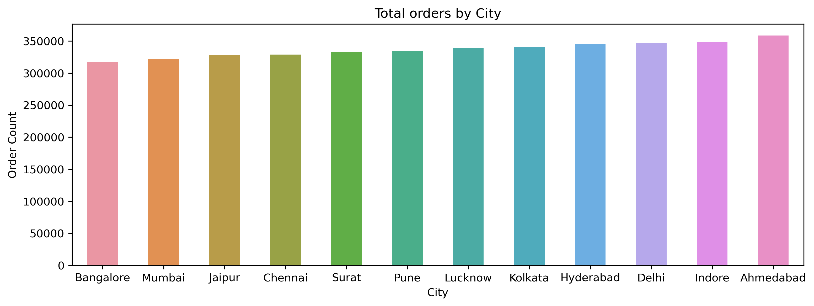
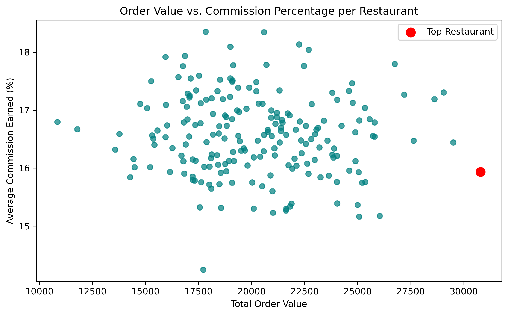
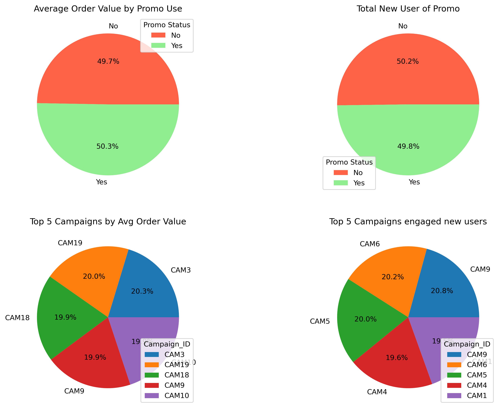
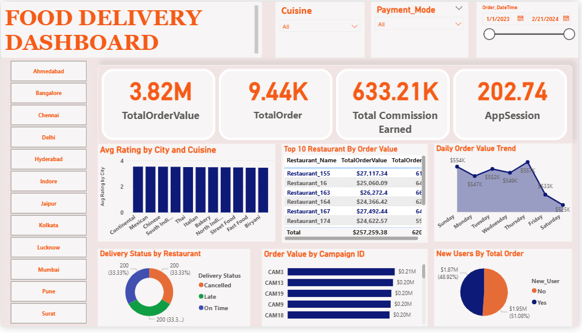

# Food_Delivery_Analysis

## Objective
This project analysis food delivery data to uncover insights about customer behaviour, restaurant performance, and promotion effectiveness using Python data analysis libraries.  
## Tools used
✅ Python (Pandas, Numpy, Seaborn, Matplotlib)  
✅ Jupyter Notebook  
✅ Github  
## 🎯 Business Questions Addressed
- Which cities and cuisines drive the highest sales?
- Which restaurant partners need performance improvement?
- How do promotional codes impact order values?
- What is the effectiveness of different marketing campaigns?
- Which areas customer services needs to improvement?
## 📊 Dataset Information
Source: Synthetic data  
Size: 10000 x 20  
Key Columns:  
Order details (order_id, order_value, delivery_time, order_dateTime, new_user)  
Customer information (customer_id, city, customer_rating, app_session_duration, payment_mode)  
Restaurant data (restaurant_id, restaurant_name, cuisine_type, commission)  
delivery information (delivery_partner_id, delivery_partner_rating, distance_km, delivery_status)  
Promotional data (promo_code, campaign_id)  
## Insights
### 🔥 Sales & Cuisine Analysis
- **Thai cuisine** dominates sales in Indore and Lucknow.
- Ahmedabad generates the **highest order value**, while Bangalore contributes the least.
- Many restaurants contribute in order range of 15000-25000 per restaurant as well as commission percentage(%) of 15.5-17.5. 

### 🛍️ Promotion Effectiveness
- Orders using **promo codes** contributed to a **50.3% increase** in average order value.
- Campaign **`Cam9`** boosted platform reach among new users by **20.8%** and increased order value by **19.9%**.

### 🚴 Delivery Partner Performance
- Identified specific **delivery partners** with ratings < 3 needing training or performance improvement.

## 📈 Visual Highlights

### ✅ City-wise Order Value

### ✅ Restaurant order and commission info

### ✅ Impact of Promo Codes and Campaigns

###  ✅ Dashboard

  
